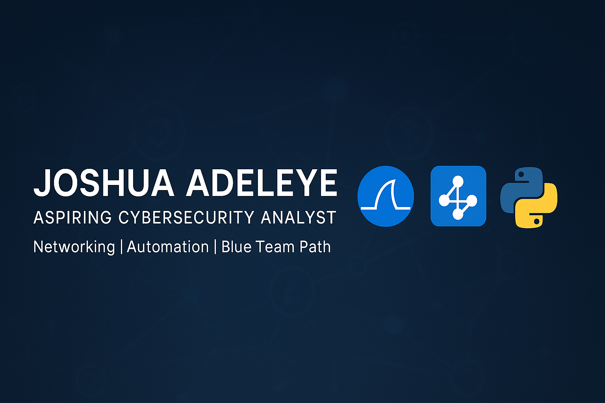

# Hello, I'm Joshua 👋

**Aspiring Cybersecurity Analyst** | Building Networking & Automation skills, one lab at a time.  
Currently learning **CompTIA Network+**, developing Packet Tracer labs, and exploring **Python for automation** through the Google IT Automation with Python course.

---

## 🎯 Objective
To build a strong foundation in **networking, cybersecurity, and automation** and transition into a **Blue Team/SOC Analyst** role — contributing to network defense, threat detection, and incident response.

---

## 🧠 Skills
| Skill                                         | Associated Project / Status |
|-----------------------------------------------|------------------------------|
| OSI Model Analysis (Theory + Simulation)      | [Packet Tracer OSI Lab](https://github.com/YOUR-USERNAME/YOUR-REPO/blob/main/reports/cisco_packet_tracer_labs_report.pdf) |
| Basic Network Device Configuration            | [Packet Tracer Basics Lab](https://github.com/YOUR-USERNAME/YOUR-REPO/blob/main/reports/cisco_packet_tracer_labs_report.pdf) |
| Wireshark Packet Capture Analysis              | Coming Soon 🚧 |
| Python Automation Basics                       | In Progress – Google IT Automation with Python |
| Data Analysis & Reporting                      | Applied Excel & Power BI for interpreting network/log data |

---

## 🛠 Tools
### Networking & Security

    
    

### Data Analysis

    
    
    

### Programming

    

---

## 📚 Current Learning Path
1. **CompTIA Network+** (Professor Messer) – In Progress  
2. **Google IT Automation with Python** – In Progress  
3. SOC/Blue Team labs on TryHackMe, LetsDefend, and Blue Team Labs Online *(planned)*  
4. Azure & Cloud Security basics *(planned)*  

---

## 📈 Learning in Public
| Date       | Progress |
|------------|----------|
| Aug 9, 2025| Completed Packet Tracer Basics & OSI Simulation Labs |
| Aug 2025   | Starting CompTIA Network+ playlist (Professor Messer) |
| Aug 2025   | Continuing Google IT Automation with Python |

---

## 📬 Connect with Me
- [LinkedIn](https://linkedin.com/in/joshuaadeleye)
- [Email](mailto:your-email@example.com)

---

⭐ **Follow my journey** as I build skills toward a career in cybersecurity.
